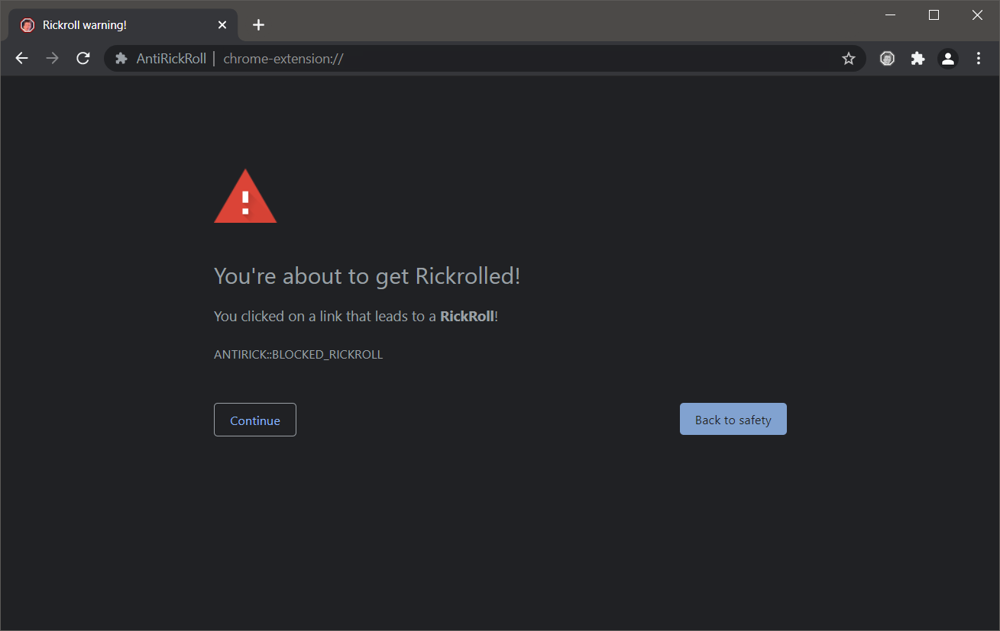

# AntiRickRoll

[](https://antirickroll.com/install)
[](https://antirickroll.com/install)
[](https://discord.gg/y7jCZCX2Bz)

> <https://antirickroll.com>

AntiRickRoll is a browser extension made to keep you safe from [rickrolls](https://www.urbandictionary.com/define.php?term=Rick%20Roll) on the internet.
This works by injecting a warning page whenever you click on a known rickroll link.



## Community

Join the Discord community here: [AntiRickRoll discord](https://discord.gg/y7jCZCX2Bz)

## Installing

Install for [Chrome](https://chrome.google.com/webstore/detail/antirickroll/mpnckpmpddjcgkpjkmmakcamjhceadne/).

Install for [Firefox](https://addons.mozilla.org/en-US/firefox/addon/antirickroll/).

## Todo

- [x] Basic Functionality
- [x] Firefox support
- [ ] Custom links to block
- [ ] Some kind of dashboard with stats, etc.

## Known bugs

To report a bug, please open an issue or report it in our discord server.

- None at the moment

## Development

### Build instructions

To build the extension with "laravel mix", you need these dependencies:

- Node.js (I am using v19.6.0)
- Yarn

Any OS should work, but I am using Arch Linux.

Then, run these commands:

```bash
yarn install # Install dependencies
yarn run prod # Build the extension in production mode
```

## Contributing

Just send a pull request, bruh.
